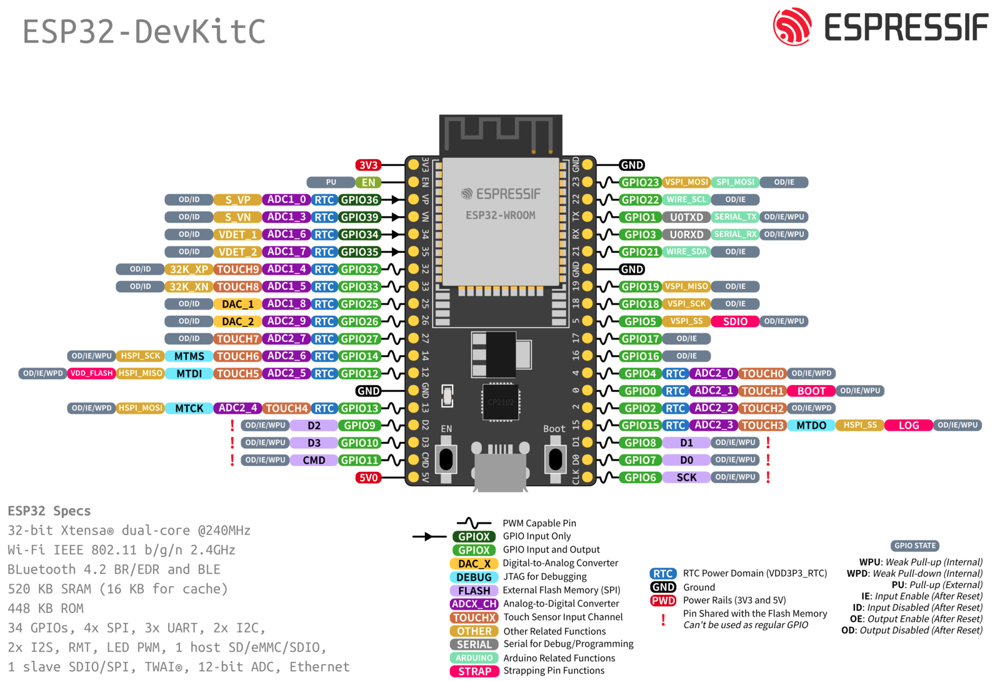

# Ping Pong arduino

Ping Pong project for university \
Using arduino-compatible microcontroller to play the classic game of ping pong

## Components

- Arduino (examples with ESP32-DevKitC)
- OLED Display SSD1306 OLED 128x64
- MAX7219 Dot Matrix 8x8 (generic module)
- Potentiometer b10k
- Piezo Crystal (buzzer)
- any switch/toggleable button

## Quick start

Here are the [schematics](https://wokwi.com/projects/417169998066026497) for the project

You need to install [platformio](https://platformio.org/platformio-ide) vscode extention or [cli](https://platformio.org/install/cli) tools

Run it via the IDE extension or:

```bash
platformio run --target upload --environment esp32
```

## Resources

https://platformio.org/ \
https://www.arduino.cc/ \
https://www.analog.com/media/en/technical-documentation/data-sheets/MAX7219-MAX7221.pdf \
https://esphome.io/components/display/ssd1306.html \
https://www.circuitbasics.com/basics-of-the-i2c-communication-protocol/ \
https://www.circuitbasics.com/basics-of-the-spi-communication-protocol/



